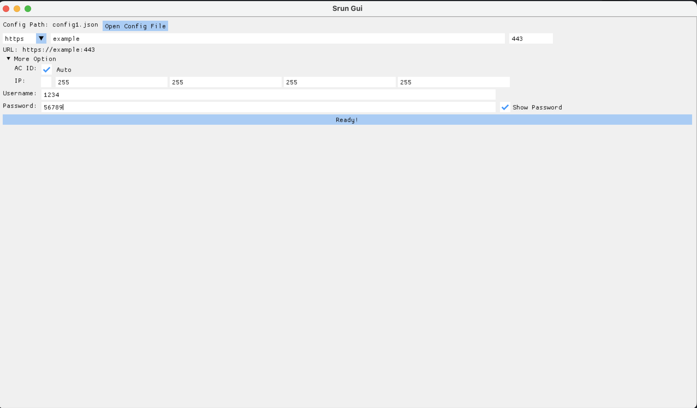
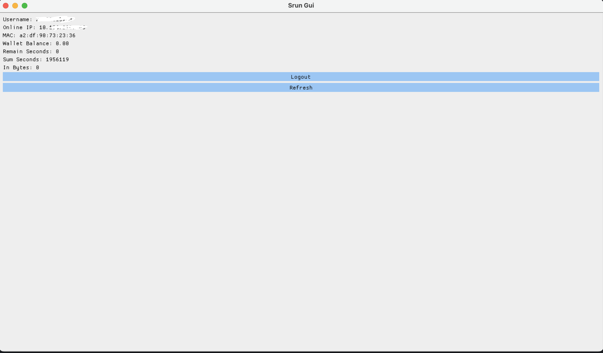
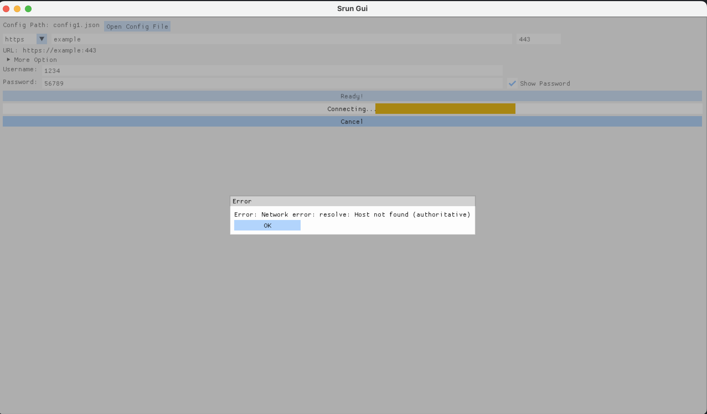

# Srun Gui

A simple gui is for [srun](https://github.com/Mrwatermolen/srun).

Use CSP to synchronize the main thread and the rendering thread to avoid multi-threading problems.

Depend on [ImGui](https://github.com/ocornut/imgui). Render backend: OpenGL3 + GLFW.

## Usage

create a `json` file or Gui config.

## Build

```bash
cmake -B -DCMAKE_BUILD_TYPE=Release ./build
cmake --build ./build -t srun_gui
```

## ScreenShot




